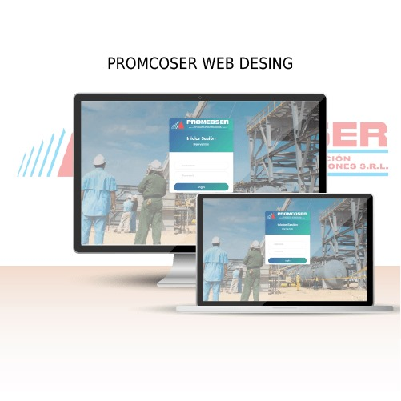
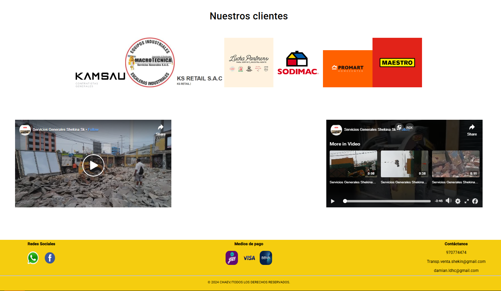
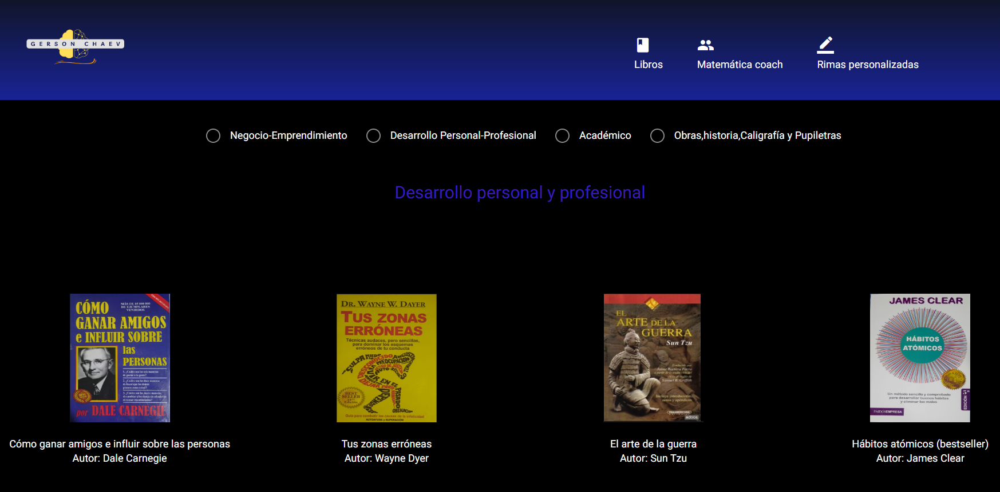
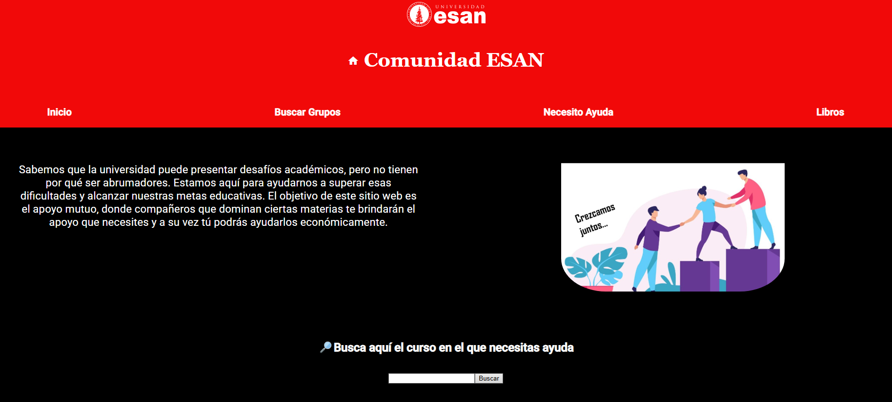

# 🌟 Portafolio Web - GERSON CHANCAS EVANGELISTA

> Repositorio personal que recopila mis principales proyectos en desarrollo web, donde combino creatividad, lógica y tecnología para resolver problemas del mundo real.

---

## 🧭 Índice
1. [📂 Lista de Proyectos](#-lista-de-proyectos)
2. [🎯 Objetivos Profesionales](#-objetivos-profesionales)
3. [📫 Contacto](#-contacto)

---

## 📂 Lista de Proyectos

> ✨ Cada proyecto representa un desafío resuelto con diseño, código y propósito.

### 📌 **1. PROMCOSER WEB**

- 🧾 **Descripción:** Página web para **Promcoser** que permite registrar y gestionar personal, maquinaria y clientes, así como digitalizar el Parte Diario para su llenado y almacenamiento en línea.

- 🔧 **Tecnologías:**
  - **Visual Studio (Backend):** Desarrollo de la lógica del servidor, APIs y conexión a la base de datos.
  - **Visual Studio Code (Frontend):** Creación de la interfaz de usuario con **Quasar Framework**.
  - **SQL Server:** Diseño y gestión de la base de datos estructurada.
  - **Git & GitHub:** Control de versiones y colaboración en el código.
  - **Google Drive:** Almacenamiento y colaboración en documentos y archivos del proyecto.
  - **Google Meet:** Comunicación para reuniones grupales y asignación de tareas.
  - **WhatsApp:** Comunicación ágil para coordinación diaria y recordatorios.

- 🔗 **Código:**
  - 🔌 **API:** [API Backend](https://github.com/GersonEvangelista/ProyectoPROMCOSERWeb.git)
  - 🖥️ **Frontend:** [Frontend](https://github.com/GersonEvangelista/ProyectoPROMCOSERWeb_Frontend.git)

- 🖼️ **Preview:**  
  

---

### 📌 **2. SHEKINA SK WEB**

- 🧾 **Descripción:** Sitio web desarrollado para una empresa de transporte de carga, especializado en ofrecer servicios logísticos y distribución de materiales de construcción.

- 🔧 **Tecnologías Utilizadas:**
  - **Angular**
  - **HTML**
  - **CSS**
  - **TypeScript**
  - **JavaScript**
  - **Node.js**

- 🔗 **Repositorio del Código:**  
  [GitHub – Página Transporte Luis](https://github.com/GersonEvangelista/PaginaTransporteLuis.git)

- 🖼️ **Preview:**  
  

---

### 📌 **3. ENTERPOD WEB**

- 🧾 **Descripción:** Sitio web para **Enterpod**, una clínica de atención integral que ofrece servicios de enfermería, podología y terapia física. El objetivo es facilitar la reserva de citas y brindar información clara sobre los servicios.

- 🔧 **Tecnologías Utilizadas:**
  - **Angular**
  - **HTML**
  - **CSS**
  - **TypeScript**
  - **JavaScript**
  - **Node.js**

- 🔗 **Repositorio del Código:**  
  [GitHub – Enterpod Web](https://github.com/GersonEvangelista/PaginaEnterpod.git)

- 🔗 **Demo:**  
  [Enterpod Web](https://en-ter-pod.web.app/terapia)

- 🖼️ **Preview:**  
  
  
---

### 📌 **4. LIBROS, ASESORÍAS, RIMAS CHAEV WEB**

- 🧾 **Descripción:** Plataforma web dedicada a la venta de libros, la creación personalizada de poemas, versos y rimas, así como la oferta de asesorías escolares en matemáticas. El sitio busca integrar el arte literario con el apoyo académico en un entorno accesible y moderno.

- 🔧 **Tecnologías Utilizadas:**
  - **Angular**
  - **HTML**
  - **CSS**
  - **TypeScript**
  - **JavaScript**
  - **Node.js**

- 🔗 **Repositorio del Código:**  
  [GitHub – Libros, Rimas y Asesorías CHAEV Web](https://github.com/GersonEvangelista/webLibrosAsesoriaRimas_CHAEV.git)

- 🔗 **Demo:**  
  [GERSON CHAEV](https://gerson-ce.web.app/book)

- 🖼️ **Preview:**  
  

---

### 📌 **5. ESAN WEB**

- 🧾 **Descripción:** Plataforma web diseñada para fomentar la colaboración entre estudiantes de la universidad ESAN. Ofrece servicios de asesoría académica entre pares y facilita el acceso a enlaces para unirse a comunidades específicas de cada facultad.

- 🔧 **Tecnologías Utilizadas:**
  - **Angular**
  - **HTML**
  - **CSS**
  - **TypeScript**
  - **JavaScript**
  - **Node.js**

- 🔗 **Repositorio del Código:**  
  [GitHub – ESAN Web](https://github.com/GersonEvangelista/webESAN.git)

- 🖼️ **Preview:**  
  

---

## 🎯 Objetivos Profesionales

✅ Construir aplicaciones web accesibles, escalables y centradas en el usuario.  
✅ Integrar buenas prácticas de diseño UI/UX.  
✅ Desarrollar proyectos de impacto real y colaborar con equipos interdisciplinarios.  
✅ Seguir aprendiendo nuevas tecnologías del ecosistema web.

---

## 📫 Contacto

¿Quieres colaborar o tienes una propuesta? ¡Estoy abierto(a) a nuevas oportunidades!

- 💼 LinkedIn: [https://www.linkedin.com/in/gersonchaev](https://www.linkedin.com/in/gersonchaev)  
- 📧 Email: [chancasevangelistagerson@gmail.com](mailto:chancasevangelistagerson@gmail.com)  
- 💻 GitHub: [https://github.com/GersonEvangelista](https://github.com/GersonEvangelista) 

---

## 📝 Licencia

Este repositorio está bajo la Licencia [BACHI](gce_chaev).  
